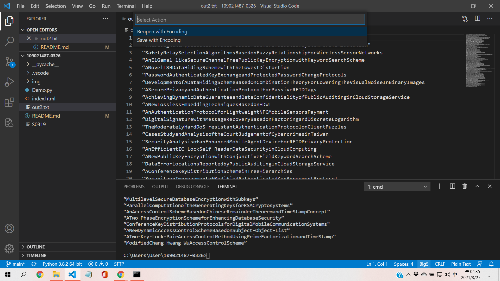
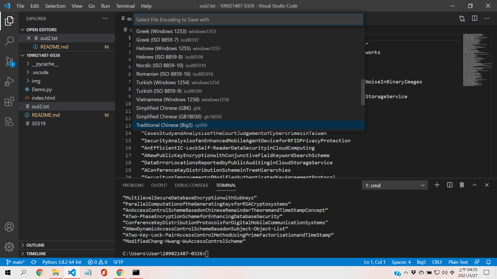

# 109021487-0319
- 套件:SFTP
1.進入VScode進行套件下載
2.Google查詢-->install from sftp

***

- json
"connect Timeout":30000,
ctrl S

***

- terminal
ssh bs109~~~@210.70.80.21
[bs109~~~@localhost~]$ll
[bs109~~~@localhost~]$cd public_html/
[bs109~~~@localhost~]$ll
tatal >0 -->success

***

{
    "name": "My Server",
    "host": "210.70.80.21",
    "protocol": "sftp",
    "port": 22,
    "username": "bs109021487",
    "remotePath": "/home/bs109021487/public_html",
    "uploadOnSave": true
}

***
***
***
#0326的筆記!!!
out2.txt要記得轉成big5

import requests as req
from bs4 import BeautifulSoup
r=req.get(
    "http://isrc.ccs.asia.edu.tw/www/myjournal/myjournal.htm")
r.encoding="big5"
if r.status_code==200:
    #print(r.text)
    soup=BeautifulSoup(r.text,"lxml")
    #print(soup)
    result1=soup.find_all("p")
    fp=open("out2.txt","w",encoding="big5")
    #print(result1)

    for val in result1:            
        text1=val.text.replace('\xa0','')
        text1=text1.replace('\u2011','')
        text1=text1.replace('\xe9','')
        text1=text1.replace(' ','')
        text1=text1.replace('\n','')
        data=text1.split(",")
        for i in data:
            if '''“''' in i:
                print(i)
                fp.write(i+'\n')
    fp.close()
else:
    print("no page")