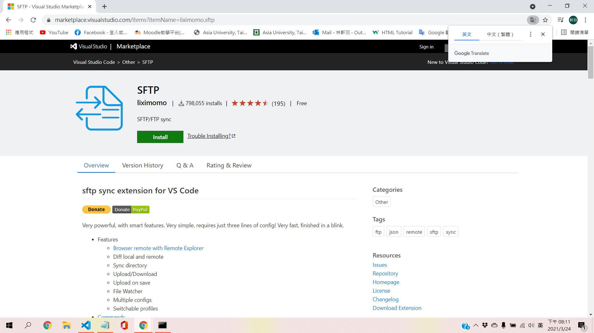

# 109021487-0319
- 套件:SFTP
1.進入VScode進行套件下載
2.Google查詢-->install from sftp

***

- json
"connect Timeout":30000,
ctrl S

***

- terminal
ssh bs109~~~@210.70.80.21
[bs109~~~@localhost~]$ll
[bs109~~~@localhost~]$cd public_html/
[bs109~~~@localhost~]$ll
tatal >0 -->success

***

{
    "name": "My Server",
    "host": "210.70.80.21",
    "protocol": "sftp",
    "port": 22,
    "username": "bs109021487",
    "remotePath": "/home/bs109021487/public_html",
    "uploadOnSave": true
}

